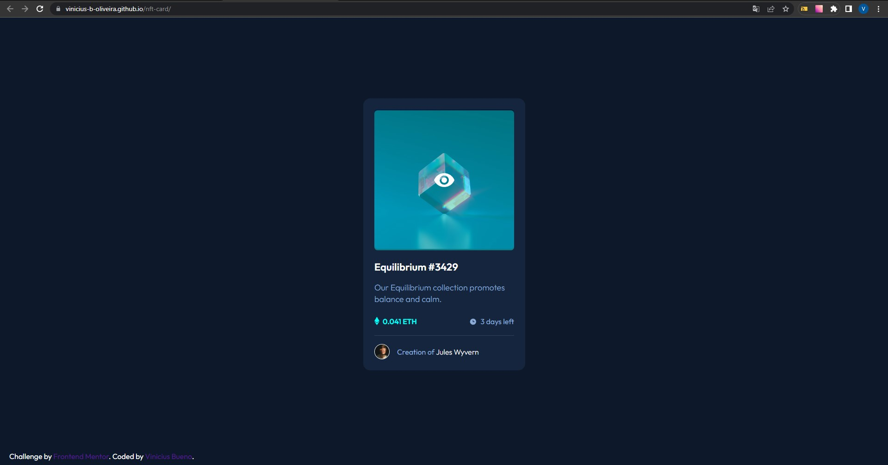

# Frontend Mentor - NFT Card

Essa é a minha solução para o desafio [NFT preview card component challenge on Frontend Mentor](https://www.frontendmentor.io/challenges/nft-preview-card-component-SbdUL_w0U).

## Sumário

- [Visão Geral](#visão-geral)
  - [Desafio](#desafio)
  - [Print](#print)
  - [Links](#links)
- [Meu processo](#meu-processo)
  - [Tecnologias](#tecnologias)
  - [Pratica de Aprendizado](#pratica-de-aprendizado)
- [Autor](#autor)
- [Agradecimentos](#agradecimentos)

## Visão Geral

### Desafio

- Fazer o projeto da maneira mais fiel possível ao design dado.

### Print



### Links

- Solução: [Ir para solução](https://vinicius-b-oliveira.github.io/nft-card/)

## Meu Processo

### Tecnologias

- Marcação semantica com HTML 5
- Folhas de estilo em cascata no CSS 3
- Estilos flexiveis usando CSS Flexbox
- Armazenamento de propriedades usando variáveis CSS
- Git para versionamento de código

### Pratica de Aprendizado

Com esse projeto foi possível praticar algumas tecnologias CSS como o flex box por exemplo, além do uso de pseudo-elmentos com after e before. 

Segue abaixo um trecho de código com os conhecimentos relatados acima: 
```css
.nft-card .img-container {
    width: 100%;
    display: flex;
    justify-content: center;
    align-items: center;
    position: relative;
}

.nft-card .img-container::before {
    content: '';
    background-color: var(--primary-strong);
    position: absolute;
    width: 100%;
    height: 99%;
    border-radius: 7px;
    opacity: 0;
    transition: 0.4s ease-in-out;
}
```

## Autor

- Github - [Vinicíus Bueno](https://github.com/Vinicius-b-oliveira)
- Frontend Mentor - [Vinicíus Bueno](https://www.frontendmentor.io/profile/Vinicius-b-oliveira)

## Agradecimentos

Projeto realizado durante o curso de programação [Dev Quest](https://devemdobro.com/matriculas-abertas/) sobre mentoria dos gêmeos Ricardo Dias e Roberto Dias. 
